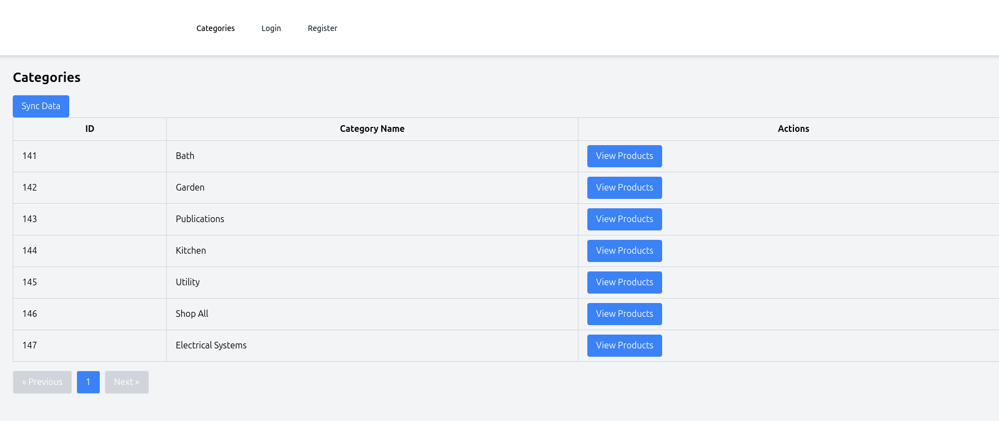

# Bigcommerce Integration 

This project integrates with Bigcommerce store with access tokens and syncs categories, products and variants.

The store's link is 

[https://store-ldaqi0ooo8.mybigcommerce.com](https://store-ldaqi0ooo8.mybigcommerce.com)

Admin Panel 

[https://store-ldaqi0ooo8.mybigcommerce.com/manage/products/](https://store-ldaqi0ooo8.mybigcommerce.com/manage/products/)

## Tech Stack

- Vue 3
- PHP 8
- Laravel 11
- Docker
- Mysql

## About The Project

Shops are stored in database with access tokens. There will be an already created shop in database. 

There are two jobs which run s every 10 minutes to sync categories, products and variants from all stores in database.

When a shop logs in with correct credentials, they are redirected to Categories page where they can navigate to Products and Variants. After following below steps system will sync relevant data from bigcommerce for all stores in db. If wanted, you can click "sync" button to sync data manually. 

Because Bigcommerce can heave multiple categories for products I used hasMany relationship between Category and Product.

You can register new shops and they will be created with same access token as the original store.

Env file is already in the repository for ease of use.

After project deployment you should see the following page when logged in.




## Installation

1. Run `docker-compose up --build ` to start the containers.

```sh
docker-compose up --build
```

2. Run `docker-compose exec optimum7-app php artisan app:project-init` to make the project ready.

```sh
docker exec optimum7-app php artisan app:project-init
```

3. You can run tests if you like.

```sh   
docker exec optimum7-app php artisan test
```

And then you can access the project at [http://localhost:8080](http://localhost:8080)


## What can be done better

- Add some webhooks to update already created products
- While syncing products and variants, there can be failures so a backup plan would be nice.  
- There is a sync button but there is a possibility schedule-syncs and manual sync would run at the same time and create duplicate data so some locking system would be the best.
- Add more tests